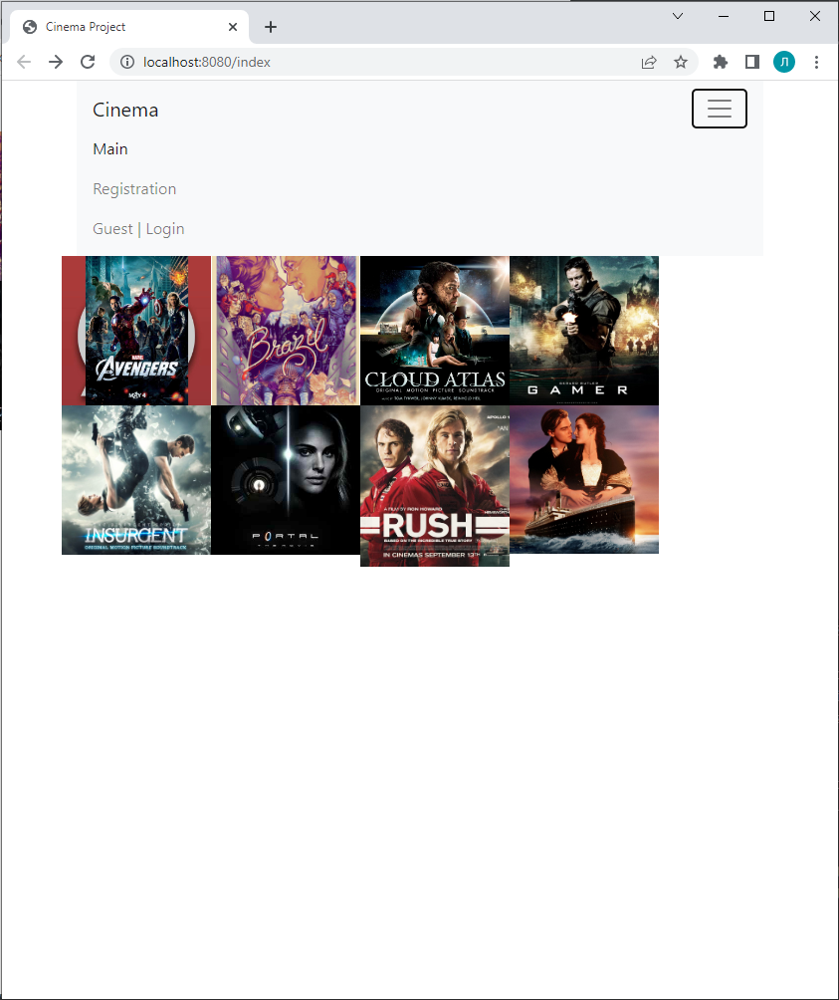
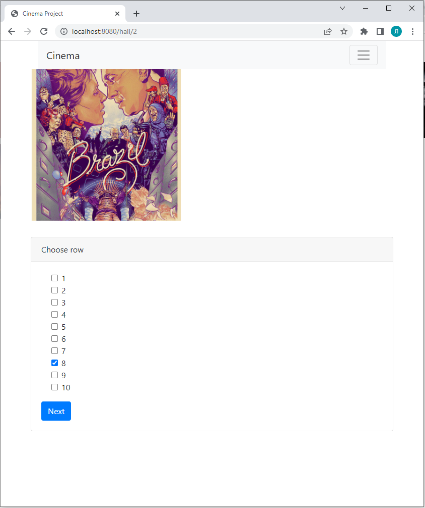
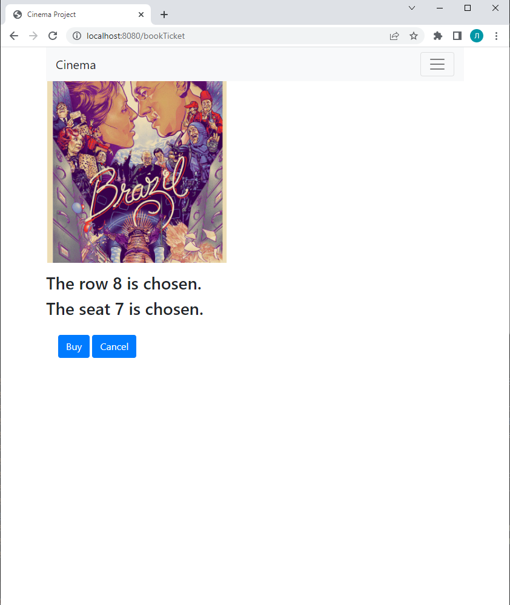
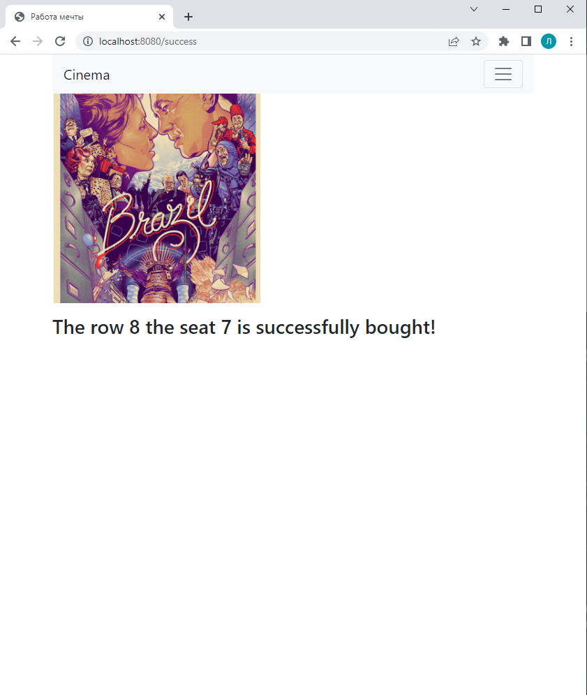

# job4j_cinema









## О проекте
Это сайт по покупке билетов в кинотеатр.
Пользователь должен быть зарегистрирован.
Авторизация происходит по проверке пары email-номер телефона.
Используется Spring boot.
При переходах со страницы на страницу данные записываются в HttpSession.
И только в самом конце записываются в БД.

## Использованные технологии
Java 17, Maven 4.0, Spring boot, PostgreSQL, Liquibase, Log4j, AssertJ,
JUnit 5, Mockito 4, H2 1.4

## Настройка окружения
Установить PostgreSQL: логин - postgres, пароль - password
Создать там БД cinema
Браузер желательно Chrome

## Запуск проекта
Создать базу данных 
```
createdb --username=ИМЯ cinema
```
Запустить командой
```
mvn spring-boot:run
```
перейти по ссылке http://localhost:8080/index

## Контакты
При возникновении вопросов, замечаний или предложений, прошу писать мне по указанным ниже контактам:

[](https://t.me/levgross)&nbsp;&nbsp;
[](mailto:levgross@gmail.com)&nbsp;&nbsp;